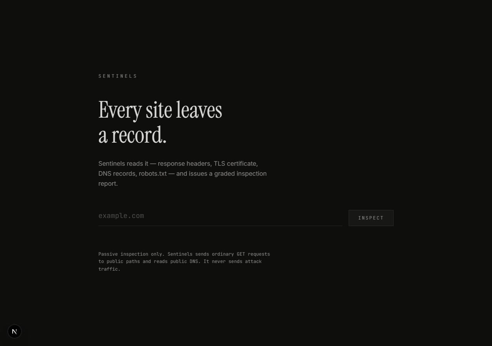
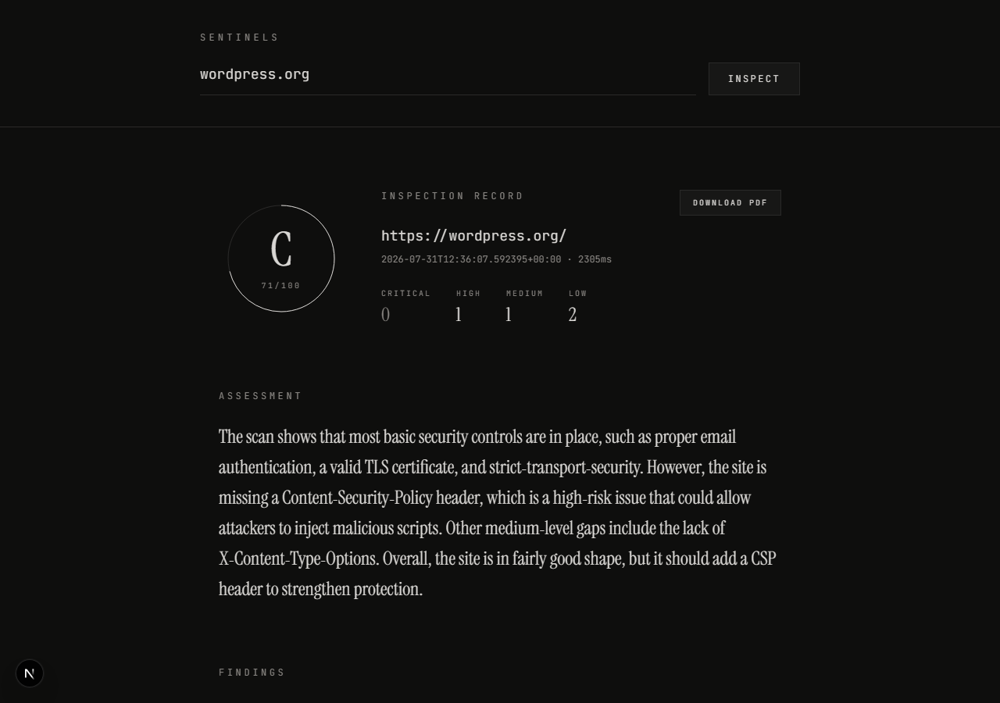

# Sentinels

**Passive** website security auditor. Put in a URL, get back a graded inspection
report in seconds — no attacks, no exploitation, nothing sent that a normal
browser wouldn't send.



## The passive-only ethic

Sentinels never attacks the sites it scans. Every check is one of:

- reading response headers (`GET` requests only)
- inspecting the TLS certificate a server already presents
- reading public DNS records
- reading `robots.txt` and checking a small number of publicly-known paths

There is no SQL injection, no brute forcing, no fuzzing, no form submission, no
denial-of-service traffic — ever. If a feature idea would require sending
something harmful, it's out of scope for this project, full stop. Sentinels is
built to be run against sites you own or are authorized to inspect, the same
way you'd read a building's fire-safety certificate rather than test the fire
alarm yourself.

## What a scan looks like

Eight agents run concurrently against the target and each contributes findings:

| Agent | Checks |
|---|---|
| **Headers** | Security headers — CSP, HSTS, X-Content-Type-Options, and more |
| **Recon** | What the site is built with, plus sensitive paths disclosed in `robots.txt` |
| **TLS** | Certificate validity, expiry, and protocol version |
| **Exposure** | Publicly-reachable `/.env` or `/.git/HEAD` (content-verified, not just status-code) |
| **DNS** | SPF and DMARC — whether the domain can be spoofed in email |
| **API Security** | Publicly reachable API docs/GraphQL, permissive CORS, response leaks, auth posture, risky methods |
| **Misconfiguration** | Directory listings, forgotten backup files, debug output, server version disclosure, default/setup pages, unsafe caching |
| **Subdomain Security** | What else the domain exposes — certificate SANs, Certificate Transparency logs, and a small common-name list, each DNS-verified — plus dangling DNS / potential takeover, honestly graded by confidence |

The findings are combined into a deterministic 0–100 score and A–F grade — the
same site scanned twice always produces the same result — then an AI layer
(optional, degrades gracefully with no key configured) adds a plain-language
summary on top. When two agents see the same underlying problem (e.g. a
subdomain missing the same header the apex is already flagged for), scoring
deduplicates repeated hits, decays them, and caps each new agent's total
penalty rather than stacking the same issue over and over.



## Scanning a repository, not just a URL

Point Sentinels at a GitHub repository instead of a live site and a second set
of agents runs against the source itself: **Secrets** (committed credentials
and keys), **Dependencies** (known-vulnerable packages), **Config**
(dangerous defaults, exposed settings), **Hygiene** (housekeeping issues that
tend to precede real bugs), and **Code Patterns** (risky patterns in the code
itself). Same scoring engine, same honesty-about-confidence rule as the live
scans.

For findings that have a safe, deterministic fix, Sentinels can open a pull
request against a repository you've explicitly connected — never a direct
commit, never a push to your default branch. The exact diff is shown before
anything happens, you approve it, and the PR body always states plainly what
it does *not* fix (secret removal, for instance, doesn't rotate the leaked
key or erase it from history — the PR says so). Every write is logged: who,
which repo, which branch, which finding.

## What Sentinels does *not* do

Every agent above stops short of the line that would turn a passive read into
an attack, even where the extra step would find more:

- **API Security** never sends a GraphQL introspection query — only reads
  what an anonymous `GET` already reveals — and never invokes a method it
  discovers via `OPTIONS` (PUT/DELETE/PATCH/TRACE are read from the `Allow`
  header, never called).
- **Misconfiguration** never invokes a risky HTTP method either, and never
  deliberately triggers an error to see a stack trace — debug output is only
  ever found in responses already fetched for other reasons.
- **Subdomain Security** never attempts to *claim* a dangling or takeover-
  shaped resource. Confirming a takeover finding for real means actively
  exploiting it, which is out of scope by design — the finding says
  "potential" and states a confidence, never a certainty.
- **No agent anywhere** sends a wordlist, brute-forces a path, submits a
  form, or sends any request beyond `GET` / `HEAD` / `OPTIONS`. Discovery
  paths are short, fixed, and named directly in the agent's own source —
  never generated or expanded at runtime.

## Tech at a glance

| | |
|---|---|
| **Backend** | Python, FastAPI, `httpx`, `asyncio.gather` for concurrent agents, Server-Sent Events for live progress, Playwright for PDF export |
| **Frontend** | Next.js (App Router), React, Tailwind CSS |
| **AI** | Groq's free-tier API (`openai/gpt-oss-20b`) for the plain-language summary — entirely optional |
| **Scoring** | Pure functions, no model in the loop — deterministic by design |

## Running it

Needs **Python 3.11+** and **Node 18+** already installed.

### 1. Backend (FastAPI)

```powershell
cd backend
python -m venv .venv
.venv\Scripts\activate
pip install -r requirements.txt
playwright install chromium
uvicorn main:app --reload
```

`playwright install chromium` is the step that's easy to miss — and the
single most likely thing to break for a stranger. `pip install -r
requirements.txt` installs the `playwright` *library*, but Playwright drives
an actual Chromium binary that ships separately and has to be downloaded once
with this command. Skip it and everything works fine — scanning, scoring, the
AI summary — right up until you click "Download PDF", which fails with a bare
`500 Internal Server Error` and no explanation in the browser. (The real
reason only shows up in the backend's own terminal: `Executable doesn't exist
at ...` followed by Playwright's own tip to run `playwright install`.) This
one command is what prevents that dead end.

The backend now serves `http://localhost:8000` (`/health` should return
`{"status": "ok", ...}`; interactive API docs are at `/docs`).

### 2. Frontend (Next.js)

In a second terminal:

```powershell
cd frontend
npm install
npm run dev
```

Open `http://localhost:3000` and scan a real site — it should show a full
graded report within a couple of seconds.

### AI summary (optional)

The report includes a plain-language AI summary if `GROQ_API_KEY` is set in
`backend/.env` (copy it from [`backend/.env.example`](backend/.env.example)).
**Not required**: with no key, every scan still returns a complete, scored
report; only the `summary` field is empty.

### Repository scanning and autofix (optional)

Sign-in and pull requests both go through a GitHub App, configured with
`GITHUB_APP_CLIENT_ID` / `GITHUB_APP_CLIENT_SECRET` (sign-in) and
`GITHUB_APP_SLUG` / `GITHUB_APP_ID` / `GITHUB_APP_PRIVATE_KEY_PATH` (autofix).
`backend/.env.example` documents each variable and what happens if it's left
unset — the live-site scanning half of the app works completely independently
of any of this.

## Project layout

```
backend/    FastAPI app, agents/, ai/, remediation/, auth/, report/
frontend/   Next.js App Router + Tailwind
```

The project's non-negotiable design rules (passive-only scope, bounded
probing, deterministic scoring, the autofix rules) live in
[`CONVENTIONS.md`](CONVENTIONS.md).
